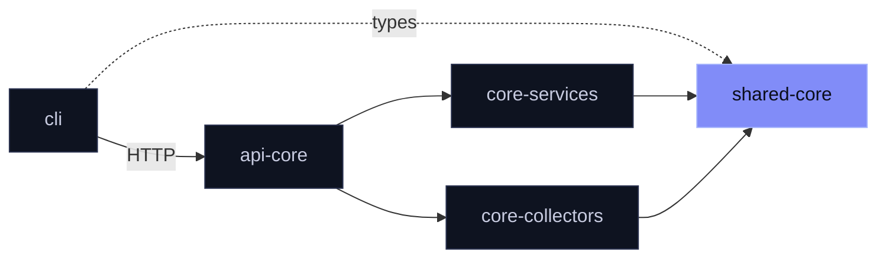

<div align="center">

# `@mira/shared-core`

**The contract every Mira package agrees on.**

Types · `Result<T, E>` · JSON logger · usage recorder

[](https://www.npmjs.com/package/@mira/shared-core)
[](./LICENSE)

</div>

<br>

Mira collects discussion from Reddit, Hacker News and RSS, extracts pain points with an LLM and clusters them into themes. `shared-core` is the bottom layer — the shapes and helpers the other packages share. It depends on no other Mira package.

## Install

```sh
npm install @mira/shared-core
```

## Three entry points

| Import | Gives you |
|:--|:--|
| `@mira/shared-core` | Collected-item, extraction and research types · `Result<T, E>` · `BatchError` · the `Collector` contract |
| `@mira/shared-core/logger` | Pino JSON lines · secret-key redaction · `debug`/`info` to stdout, `warn`/`error` to stderr |
| `@mira/shared-core/usage-scope` | Per-run accounting of LLM tokens, embeddings and source calls |

> [!NOTE]
> The logger and usage recorder live on subpaths so the root entry stays free of Node-only dependencies.

## Use

**Fail as a value.**

```ts
import type { Result } from '@mira/shared-core'

function parse(raw: string): Result<number> {
  const n = Number(raw)
  return Number.isNaN(n) ? { ok: false, error: new Error('not a number') } : { ok: true, value: n }
}
```

**Log without leaking.**

```ts
import { createLogger } from '@mira/shared-core/logger'

const log = createLogger({ base: { service: 'my-worker' } })
log.warn('upstream slow', { token: 'never printed', ms: 1800 })
```

**Count what a run costs.**

```ts
import { createUsageRecorder, runWithUsageRecorder, recordLlmUsage } from '@mira/shared-core/usage-scope'

const recorder = createUsageRecorder()
await runWithUsageRecorder(recorder, async () => {
  recordLlmUsage({ promptTokens: 1200, completionTokens: 300 })
})
recorder.snapshot()
```

Every `record*` call is a no-op outside a scope, so library code can emit usage without knowing whether anyone is listening. Duplicate copies of the module in one process share a single recorder.

> [!IMPORTANT]
> `Collector` is a type contract only. The open-core API runs its built-in sources and does not load custom collectors — use the contract in code that calls `collect` directly.

## Where it sits



<details>
<summary><b>Configuration</b></summary>

<br>

| Variable | Effect |
|:--|:--|
| `NODE_ENV=development` | Enables debug logs |
| `MIRA_DEBUG_LOGGING=true` | Enables debug logs |

</details>

<details>
<summary><b>Build from source</b></summary>

<br>

Clone next to the other open-core repositories in a pnpm workspace, then:

```sh
pnpm install && pnpm build
```

</details>

<br>

<div align="center">
<sub>
Part of <a href="https://github.com/mira-js">Mira's open core</a> ·
<a href="./LICENSE">AGPL-3.0-only</a> ·
<a href="https://github.com/mira-js/.github/blob/main/CONTRIBUTING.md">Contributing</a> (<a href="https://github.com/mira-js/.github/blob/main/CLA.md">CLA</a>) ·
<a href="https://github.com/mira-js/shared/security/advisories/new">Report a vulnerability</a>
<br>
Copyright (C) 2026 Fernando Nieto Pallares
</sub>
</div>
